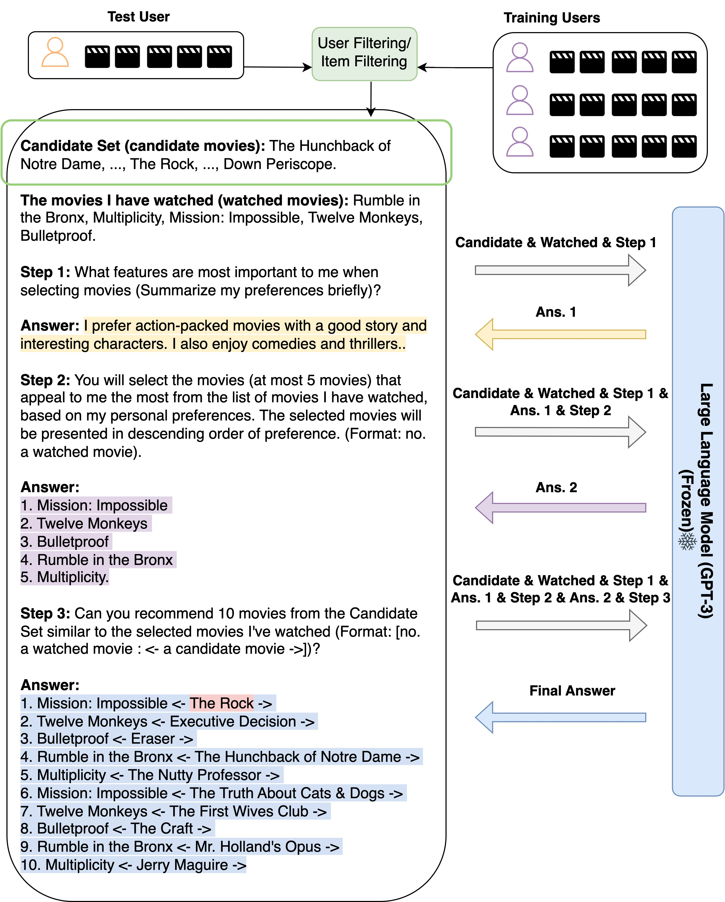

# Zero-Shot Next-Item Recommendation (Updating)
Code for the Paper "Zero-Shot Next-Item Recommendation using Large Pretrained Language Models"




## News

**04/10/2022**: We updated code for Zero-Shot NIR on ml-100k.<br/>

## Quick Start

Command for Zero-Shot NIR on ml-100k 
~~~
python three_stage_0_NIR.py
~~~

## :star: Star History

[](https://star-history.com/#AGI-Edgerunners/LLM-Next-Item-Rec&Date)

## Citations

```bibtex
@article{wang2023zero,
  title={Zero-Shot Next-Item Recommendation using Large Pretrained Language Models},
  author={Wang, Lei and Lim, Ee-Peng},
  journal={arXiv preprint arXiv:2304.03153},
  year={2023}
}
```
